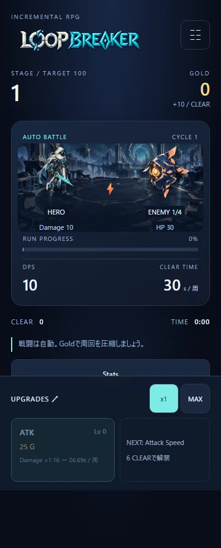

# LOOP BREAKER

30秒のRUNを強化・Prestige・BURSTで限界まで圧縮するインクリメンタルRPG。

**[Play LOOP BREAKER](https://mkunori.github.io/loop-breaker/)**



React + TypeScript + Vite、通常CSS、break_infinity.jsを使用しています。バックエンドは不要です。SaveはlocalStorageに保存され、Export / Importできます。非表示中や終了中の進行はありません。複数タブで同時にプレイしないでください。

Node.js 24とnpmを使用します。依存バージョンはpackage-lock.jsonで固定しています。

```sh
npm ci
npm run dev
```

ブラウザで `http://127.0.0.1:5173/loop-breaker/` を開いてください。

```sh
npm run build
npm run preview
```

production buildは `dist/` に出力します。previewは `http://127.0.0.1:4173/loop-breaker/`。ViteのbaseはGitHub Pages向けの `/loop-breaker/` です。

mainへのpushは全CI成功後にGitHub Pagesへdeployします。PRは検証とartifact作成だけで、本番deployしません。[公開手順・Smoke Test](docs/DEPLOYMENT.md)を参照してください。

検証コマンド:

```sh
npm run lint
npm run typecheck
npm test
npm run build
npx playwright install chromium
npm run test:e2e
```

Playwrightはbuild済みのアプリを320px・360px・390px・PC幅で確認します。Linuxでブラウザのシステム依存も必要な場合は `npx playwright install --with-deps chromium` を使用してください。GitHub ActionsはPRとmainへのpushで同じ検証を行います。フォーマットは `npm run format`。

- [ゲーム仕様](docs/GAME_DESIGN.md): 周回・Stage・解禁・Prestige・UI
- [バランス設計](docs/BALANCE_DESIGN.md): 数式・価格・12Cycleの参考進行
- [技術設計](docs/TECHNICAL_DESIGN.md): 一括計算・Save/Migration・テスト
- [初期実装の検証記録](docs/IMPLEMENTATION_NOTES.md): ファイル構成・仕様補足・検証結果・残課題
- [Visual Design](docs/VISUAL_DESIGN.md): アート方向・Stage帯・モバイル優先事項
- [公開手順](docs/DEPLOYMENT.md): Pages構成・設定・merge後のSmoke Test・Saveの扱い
- [Art Assets](docs/ART_ASSETS.md): オリジナル生成素材17枚・容量・最適化・演出・検証

設計用の参照計算はPython 3標準ライブラリだけで再現できます。

```sh
python docs/balance/simulate.py
python docs/balance/simulate.py --check
```
