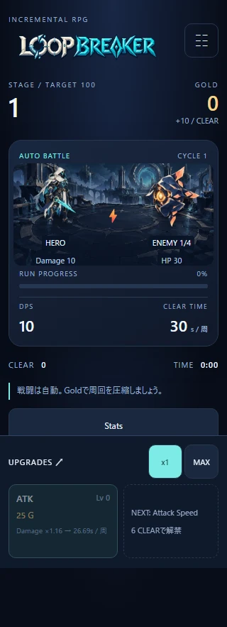
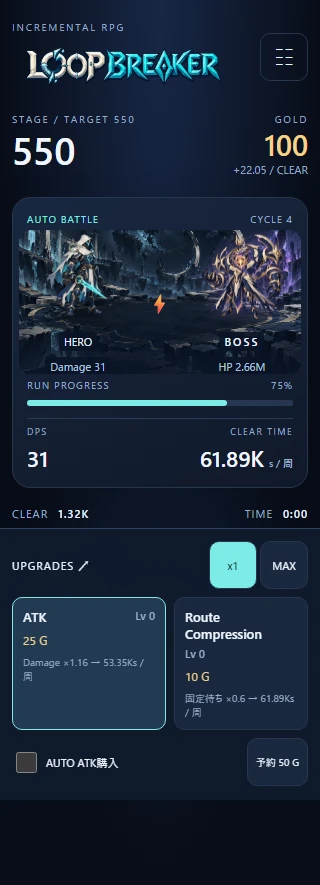
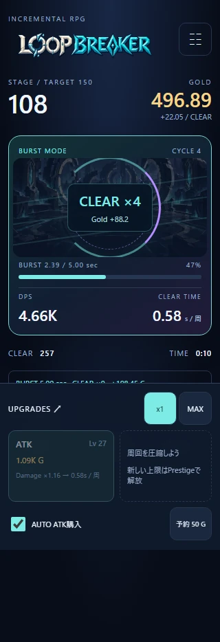
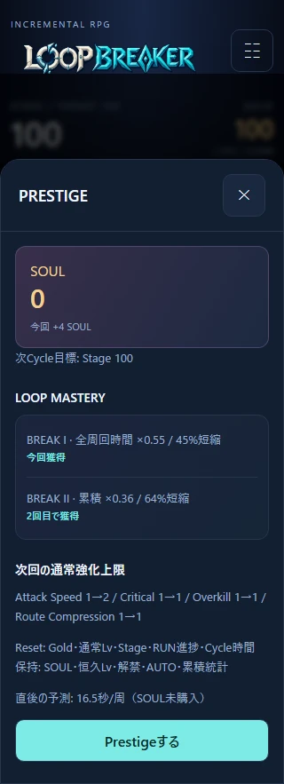
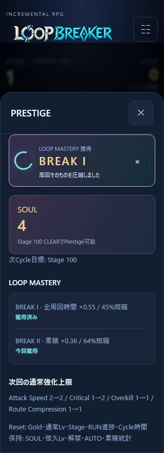
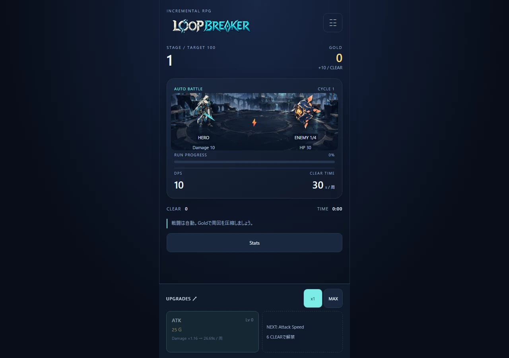

# Issue #5 Visual Review

Playwright Chromiumで取得したレビュー用画面。通常画面は320×720 / 360×800 / PC 1280×900のviewportで確認した。fullPage画像にはスクロール先も含む。静止画のためMASTERYの登場アニメーションは撮影時に完了させている。

ゲーム用アセット17枚とは別の証跡で、ゲームから配信・読み込みしない。7枚合計232,146 bytes。

## 通常戦闘とモバイル

Stage / Gold / DPS / CLEAR TIME / CLEARと下部購入欄の読みやすさ、HeroとEnemyの識別を確認してほしい。

## Bossと最終Zone

Stage 550以降の崩壊背景と、通常Enemyとは異なるBossのシルエット。

## BURSTとReduced Motion

回転を止めても、圧縮リング・集計カード・BURSTラベルで状態を判別できることを確認してほしい。装飾DOM数はCLEAR数に依存しない。

## PrestigeとLOOP MASTERY

紫と金のSOUL画面、BREAK I/IIのカード、実際の獲得時だけ表示する5秒の通知。

## PC

モバイルの中央カラムを保ち、背景の余白を拡張する。

iOS Safari実機でのスクロール・画面ロック・描画負荷は未確認。自動検証の詳細と全アセット一覧は[ART_ASSETS.md](../ART_ASSETS.md)を参照。
